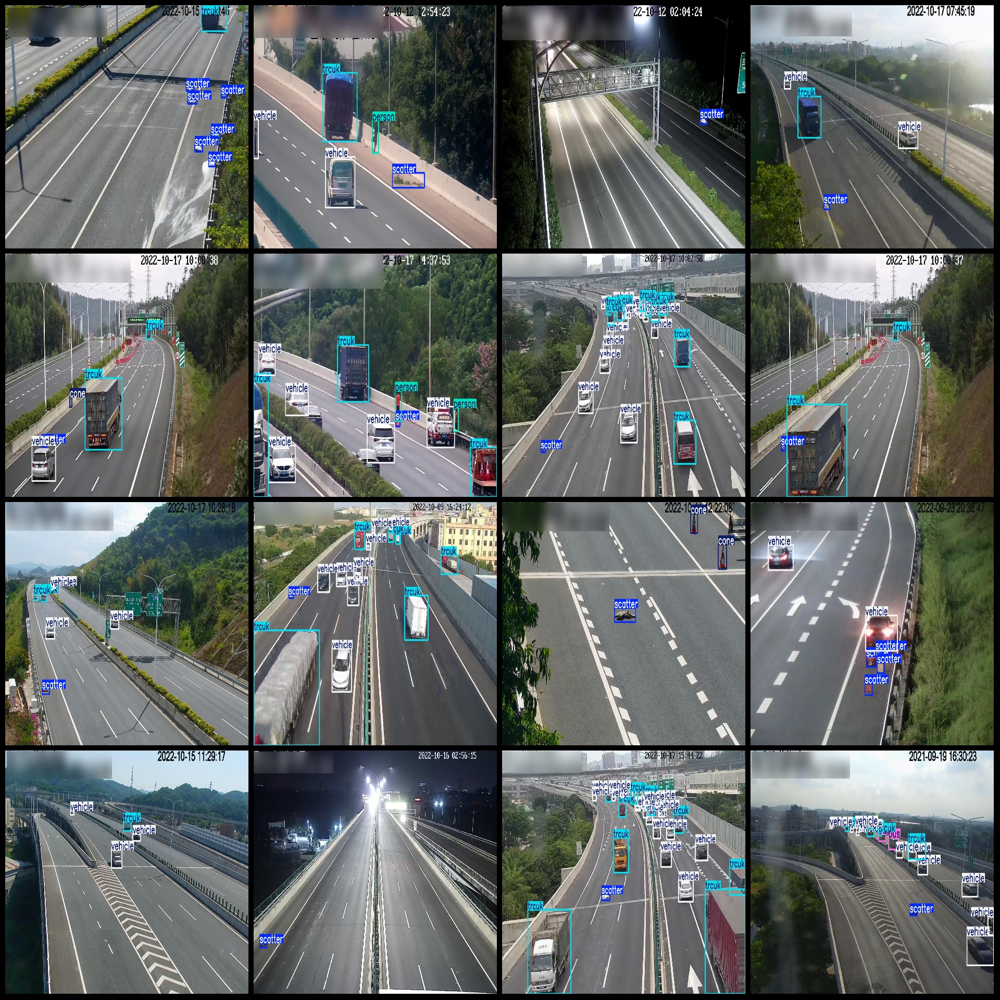
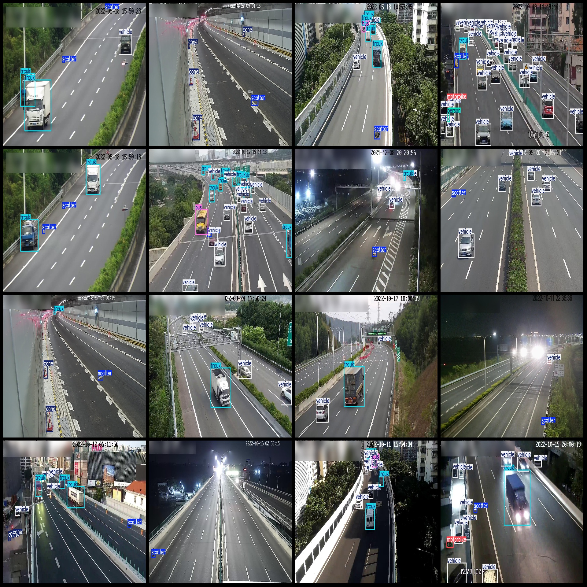

# Smart Traffic Highway City Road Pavement Vehicle Behavior Spillage Detection Data Set VOC+YOLO Format with 2797 Images in 7 Categories

Dataset format: Pascal VOC format + YOLO format (excluding the split path's txt file, only containing jpg images and corresponding VOC format xml files and yolo format txt files)
Number of images (jpg file count): 2797
Number of annotations (xml file count): 2797
Number of annotations (txt file count): 2797
Number of annotation categories: 7
Annotation category names (note that the order of labels in the yolo format is not consistent with this, but rather based on the "classes.txt" in the labels folder): ["bus", "cone", "motorbike", 
"person", "scatter", "trcuk", "vehicle"]
Number of boxes for each category:
bus (Bus) boxes = 472
cone (Cone) boxes = 891
motorbike (Motorbike) boxes = 100
person (Person) boxes = 685
scatter (Scatter) boxes = 4003
truck (Truck) boxes = 5998
vehicle (Vehicle) boxes = 16208
Total number of boxes: 28357
Image resolution: 1920x1080
Annotation tool used: labelImg
Annotation rules: Draw a box around the category
Important note: No guarantees are made regarding the accuracy of trained models or weight files
Image preview:

## Images

Here is a pay link on Stripe ( https://buy.stripe.com/3cs8yP7sY87d0vu9AB ). Please contact me lonlonago@foxmail.com after funding $89, and I will send you a complete data files , thank you!

